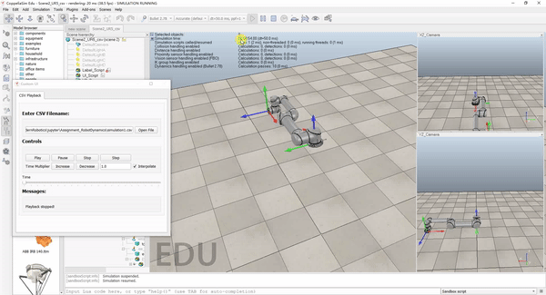

# Modern Robotics Course 3 (Robot Dynamics) Project

Instructor: [Kevin M. Lynch](https://robotics.northwestern.edu/people/profiles/faculty/lynch-kevin.html)

## Introduction

This repository containts my work for the course project of the Specialization [Modern Robotics:Mechanics, Planning and Control Specialization](https://www.coursera.org/specializations/modernrobotics)

In this project I have wrote the code that simulates the motion of the UR5 for a specified amount of time (in seconds), from a specified initial configuration (at zero velocity), when zero torques are applied to the joints. In other words, the robot simply falls in gravity. Gravity is g = 9.81m/s^2 in the -z direction, i.e., gravity acts downward. The motion is simulated with at 100 integration steps per second. The program calculate and record the robot joint angles at each step. This data is saved as a *.csv file, where each row has six numbers separated by commas. This .csv file is suitable for animation with the [CoppeliaSim](https://www.coppeliarobotics.com/) UR5 csv animation scene.This project involves the [modern_robotics library](https://github.com/NxRLab/ModernRobotics) to calculate the Forward Dynamics of the robot. The 4th Order Ruge-Kutta method is used for the numerical integration.
 

## Requirements

Since the simulated robot has no friction and zero motor torques, no energy is added or subtracted during the simulated motion. Therefore, the total energy of the robot (kinetic plus potential) must remain constant during the simulation. The result can be drawn from the curve of the kinetic energy of the robot in [this notebook](https://github.com/RuoyuLi92/Robot_Dynamic_Project/blob/master/code/RobotDynamic.ipynb) 

## Result

The motion of UR5 Robotarm from initial position and velocity is demonstrated as follows

